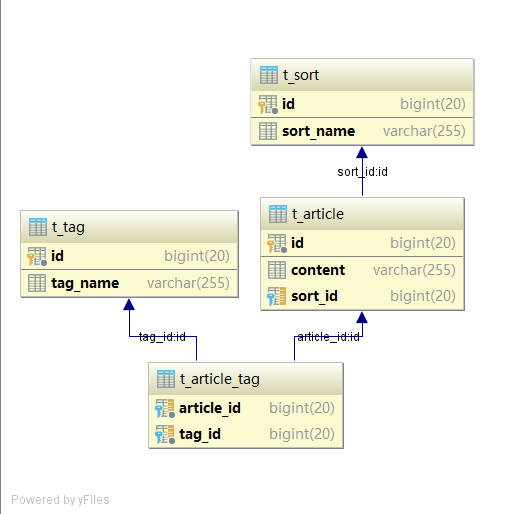

# Spring Data JPA

用一个博客项目经常遇到的例子来做示例。

博客文章需要分类和标签，也就是有 `文章`、`分类`、`标签` 三个实体，这三个实体之间的对应关系是：

- 文章对分类，一对多
- 文章对标签，多对多

用数据库关系图来描述这种关系：



## 双向一对多关系

在 Article 实体类中使用 `@ManyToOne` 注解，在 Sort 实体类中使用 `@OneToMany` 注解，这样就建立了双向的一对多关系：

```java
// 设置级联状态
@ManyToOne(fetch = FetchType.EAGER, cascade = CascadeType.ALL)
// ManyToOne 表示多对一关系
private Sort sort;
```

```java
/**
* @OneToMany 是一对多关系，与 Article 类中定义的 @ManyToOne 对应。
*      mappedBy 属性指明了 Article 类中维护这一关系的字段是 sort。
*/
@OneToMany(fetch = FetchType.LAZY, cascade = CascadeType.ALL, mappedBy = "sort")
// 在 json 化的时候忽略
@JsonIgnore
private List<Article> articleList;
```

如果需要 json 化，还应该在 Sort 实体类的 `articleList` 字段加上 `@JsonIgnore` 注解以避免 json 化的时候出现无限循环（infinite recursion）。

## 双向多对多关系

多对多关系需要使用的注解是 `@ManyToMany`，分别在关系的两个实体类中对应的属性上注明。

Article.java:

```java
/**
* @ManyToMany 表示多对多关系，fetch 属性设置更新选项，有 FetchType.EAGER 和 FetchType.LAZY 两种选择；
* @JoinTable 是自定义数据库中用于维护多对多关系的表，name 属性定义了表名，
*      joinColumns 属性是本表中加入维护关系表的字段，可以有多个；
*          @JoinColumn 是行，name属性是字段名，referencedColumnName 是本类中代表主键的属性；
*      inverseJoinColumns 属性是其他字段，也可以有多个。
*/
@ManyToMany(fetch = FetchType.EAGER)
@JoinTable(name = "t_article_tag", joinColumns = @JoinColumn(name = "article_id", referencedColumnName = "id"),
inverseJoinColumns = @JoinColumn(name = "tag_id", referencedColumnName = "id"))
private List<Tag> tagList;
```

Tag.java:

```java
@ManyToMany(fetch = FetchType.EAGER)
@JoinTable(name = "t_article_tag", joinColumns = @JoinColumn(name = "tag_id", referencedColumnName = "id"),
inverseJoinColumns = @JoinColumn(name = "article_id", referencedColumnName = "id"))
@JsonIgnore
// Json 序列化的时候忽略 Tag 对象中的 articleList，避免无限循环
private List<Article> articleList;
```

同样，需要 json 化的时候在 Tag 实体类的对应字段上加 @JsonIgnore 注解。

## 查询

Spring Data JPA 提供了多种多样的查询方式：

1. 属性名查询（通过实体类属性）

```java
/** 
* 通过名字查询，参数为 name
* 相当于 JPQL: select p from Person p where p.name = ?1
*/
List<Article> findArticleById(Long id);

Article findArticleByContentLike(String content);
```

2. 使用 `@NamedQuery` 查询

```java
@Entity
@Table(name = "t_article")
@NamedQuery(name = "Article.queryById", query = "select a from t_article a where a.id = ?1")
public class Article { ... }
```

3. 使用 `@Query` 查询

```java
public interface ArticleRepository extends JpaRepository<Article, Long> {
    @Query("select a from t_article a where a.id = ?1")
    Article queryThroughId(Long id);
}
```

4. 排序

```java
articleRepository.findAll(new Sort(Direction.DESC, "id"));
```

5. 分页

```java
articleRepository.findAll(new PageRequest(1, 2));
```